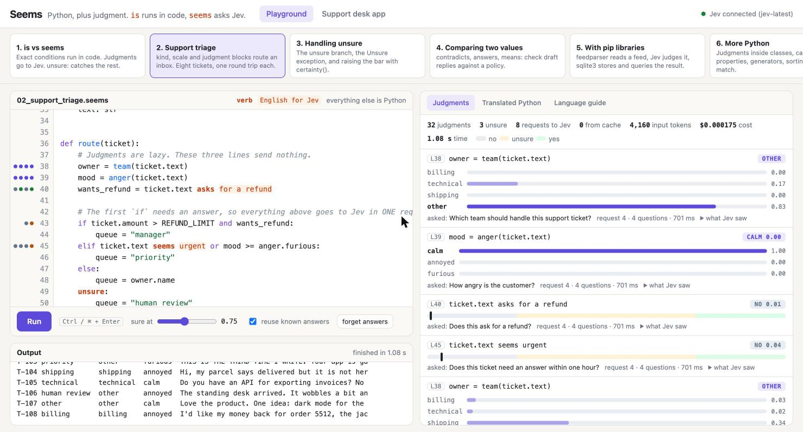

# Seems: Python, plus judgment

Seems is a programming language with judgment built in. It is Python plus a few words: a condition can be plain English, and [TypeSafe Jev](https://typesafe.ai) answers it.

```python
if order.total > 500 and ticket.text asks for a refund:
    send_to_manager(ticket)
unsure:
    send_to_human(ticket)
```

- `order.total > 500` is **exact**. Python answers it.
- `ticket.text asks for a refund` is a **judgment**. Jev answers it with a probability.
- A judgment is **yes, no or unsure**. `unsure:` is a real branch of `if`.

- **Language guide:** [kavehmz.github.io/seems-lang](https://kavehmz.github.io/seems-lang/) (the same text as [LANGUAGE.md](LANGUAGE.md))
- **The brief the project started from:** [BRIEF.md](BRIEF.md)
- **Measured results and odd cases:** [VERIFICATION.md](VERIFICATION.md)

## Run it

Everything runs in a container. Nothing is installed on the host. You need Docker (or Podman with
`docker compose`) and a TypeSafe API key.

```sh
cp .env.example .env            # put your TYPESAFE_API_KEY in it
docker compose up --build -d
```

Open [localhost:3004](http://localhost:3004). Running a program makes real, billable requests.
A typical example costs about $0.0001.

```sh
docker compose run --rm app pytest                        # 72 tests, no network
docker compose run --rm app python tools/live_check.py    # every example against the real API
docker compose run --rm -T app python tools/build_guide.py > docs/index.html   # rebuild the guide page
docker compose run --rm app python -m seems run --stats examples/02_support_triage.seems
docker compose down
```

## What to look at

**Playground** ([localhost:3004](http://localhost:3004))

- Six examples, from the core idea to pip libraries. Edit them or write your own.
- The language guide is also served at [localhost:3004/guide](http://localhost:3004/guide).
- The editor colours the judgment verb and the English that goes to Jev. The colours
  come from the real parser. A mistake shows up as you type, with its line.
- **Judgments** tab: every judgment with its probability, the exact question and state
  Jev got, the request it travelled in, tokens, cost and time.
- **Translated Python** tab: the Python your program became. Same line numbers.
- The `sure at` slider moves the bar between yes, unsure and no. Try 0.95 on example 1.

**Support desk app** ([localhost:3004/desk](http://localhost:3004/desk))

- A real small web service: Flask routes, a SQLite table, JSON API.
- It is written in Seems: [app/desk.seems](app/desk.seems). The server loads it with a plain `import desk`.
- Send the sample tickets. The rule `amount > 500` runs in code. Jev reads the text.
  Every ticket needs one request to Jev, about 0.7 seconds.

## How it works

```
program.seems ──► translator ──► plain Python ──► Python runs it
                  (no AI, fixed rules)               │
                                                     ▼
                                   runtime: lazy judgments, 3-valued logic,
                                   batching, cache, trace ──► Jev (HTTP)
```

1. **A superset of Python.** This is the TypeScript trick. Every Python file is already
   valid Seems, so classes, exceptions, async, pytest and every pip library work from day one.
   The test suite feeds 120 standard library files through the translator and they come out
   byte for byte the same.
2. **A strict grammar.** The translator uses Python's own tokenizer and fixed rules. No model
   reads the source. In valid Python two plain words never stand next to each other
   (`text seems angry`), so the new syntax cannot clash with real code.
3. **Line numbers never move.** Each source line becomes exactly one Python line. Tracebacks
   and debuggers point at the line you wrote.
4. **Three Jev primitives, three language features.**

   | Jev | Seems | Example |
   | --- | --- | --- |
   | Noul | judgment verbs, `judgment` block | `if reply contradicts policy:` |
   | Choice | `kind` block | `team(text) == team.billing` |
   | Score | `scale` block | `anger(text) >= anger.annoyed` |

5. **Unsure is part of the language.** Below 0.25 is no, above 0.75 is yes, between is unsure.
   `and`, `or`, `not` follow three-valued logic. Without an `unsure:` branch, an unsure
   judgment raises `Unsure`, so a program cannot act on a guess by accident.
6. **Fast without effort.** The TypeSafe docs say: ask independent questions about the same
   state together. The language does that for you:
   - A judgment is lazy. Nothing is sent until the program needs an answer. Then everything
     waiting goes out together. Same value, one request. Different values, parallel requests.
   - An `if / elif` statement asks the judgments of all its branches in one round trip.
   - An exact "no" skips Jev completely. Code with side effects never runs early.
7. **Repeatable.** Jev's answers move a little between identical requests (up to 0.05 here).
   Every answer is cached by model, state and question, so a second run is instant, free and
   identical.



## Measured (2026-09-19, `jev-1.13.0`, no cache)

| Example | Judgments | Unsure | Requests | Tokens | Cost | Time |
| --- | ---: | ---: | ---: | ---: | ---: | ---: |
| 01 is vs seems | 10 | 2 | 4 | 1,206 | $0.000051 | 3.1 s |
| 02 support triage (8 tickets) | 32 | 3 | 8 | 4,160 | $0.000175 | 1.0 s |
| 03 handling unsure | 6 | 3 | 6 | 1,695 | $0.000071 | 4.4 s |
| 04 comparing two values | 9 | 1 | 9 | 2,820 | $0.000118 | 3.9 s |
| 05 with pip libraries | 30 | 5 | 20 | 7,064 | $0.000297 | 2.4 s |
| 06 more Python | 10 | 0 | 5 | 2,153 | $0.000090 | 1.0 s |

One round trip to Jev takes 0.65 to 0.85 seconds from here. Time depends on how many round
trips follow each other, not on how many questions are asked. Notes and odd results are in
[VERIFICATION.md](VERIFICATION.md).

## Limits

- The tests prove the language mechanics. They do not prove that Jev judges well in your domain.
- Jev reads literally. `text seems angry` is a loose question. For anything that matters,
  declare a `judgment` with yes and no criteria.
- Math, counting, dates and exact lookups belong in Python. Jev is not for them.
- Editors and linters do not know Seems. `python -m seems translate file.seems` gives them Python.
- Judgments block the thread while they wait. There is no `await` form yet.
- A plain `for` loop asks one round after another. Use `seems.each(items, fn)` or build a
  list of judgments first.
- The playground runs any code you type, inside the container. It only accepts requests
  from a local page. Do not expose the port.

## Files

| Path | What |
| --- | --- |
| `seems/translator.py` | Seems to Python. Tokens in, same lines out. |
| `seems/runtime.py` | Lazy judgments, three-valued logic, batching, cache, trace. |
| `seems/client.py` | The HTTP call to TypeSafe. Standard library only. |
| `seems/importer.py` | `import` hook for `.seems` files, and `run_path`. |
| `seems/__main__.py` | `python -m seems run / translate / check`. |
| `app/desk.seems` | The support desk service, written in Seems. |
| `app/server.py`, `app/static/` | Playground API and pages. |
| `examples/` | Six programs and their data. |
| `docs/index.html` | The language guide page, built from `tools/guide_source.html` by `tools/build_guide.py`. |
| `tests/` | 72 tests with a fake Jev. `tools/live_check.py` uses the real one. |

The language itself needs only the Python standard library. Flask, gunicorn, feedparser and
pytest are for the demo, the examples and the tests.
